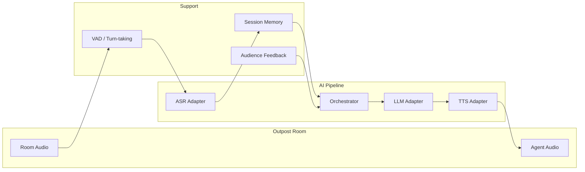

# AI Co-Host MVP – Implementation Details

This document describes the important implementation details of the AI co-host: architecture, core abstractions, pipeline behavior, Podium integration, and how to extend or swap components. It complements the [README](README.md) and the design docs ([AI Agents for Podium Outpost Rooms](AI%20Agents%20for%20Podium%20Outpost%20Rooms.md), [Checklist and Setup Guide for AI Co-Host](Checklist%20and%20Setup%20Guide%20for%20AI%20Co-Host.md), [podium interface considerations](podium%20interface%20considerations.md)).

---

## 1. Architecture Overview

The system is a real-time pipeline: room audio → VAD → ASR → session memory + feedback → LLM → TTS → room audio out. The agent joins the room as a **host** (creator or cohost) so it has permission to enter and speak.



- **Room integration**: Bot joins as a participant; subscribes to room audio, publishes TTS output. When `USE_JITSI_BOT=true`, a **browser bot** (Playwright + minimal bot page) joins the same Jitsi conference as the Podium web client; Node↔browser audio uses **48 kHz mono 20 ms frames**; Node resamples to 16 kHz only at the ASR boundary.
- **Pipeline**: Audio → VAD → ASR → (Memory + Feedback) → Orchestrator → LLM → TTS → Audio.
- **Modularity**: ASR, LLM, and TTS are behind small interfaces (adapters); config selects implementations (e.g. `ASR_PROVIDER=openai`, `LLM_PROVIDER=anthropic`, `TTS_PROVIDER=google`).
- **Observability**: Turn metrics (ASR/LLM/TTS latency, end-of-speech-to-bot-audio), watchdogs (WS, conference, audio), and structured logging.

---

## 2. Repository Structure

Single service layout with clear boundaries (suitable for later splitting into microservices):

```
podium-voices/
├── .env.local                    # Secrets; add TTS/room vars as needed (do not commit)
├── bot-page/                     # Minimal Jitsi bot join page (served by Node when USE_JITSI_BOT=true)
│   ├── bot.html
│   └── bot.js                    # WebSocket bridge; lib-jitsi-meet join; mix remote audio; synthetic mic
├── docs/
│   └── SMOKE_TEST_RUNBOOK.md     # Staging/smoke test, audio loop checks, reconnect/resume
├── scripts/
│   └── smoke.js                  # Smoke script: run co-host for N min, check USER_TRANSCRIPT / AGENT_REPLY
├── src/
│   ├── main.ts                   # Entry: load config, create adapters + memory + orchestrator;
│   │                             # start room client (or mock), wire audio in/out, optional watchdog
│   ├── config/
│   │   └── index.ts              # Env-based config (API keys, ASR/LLM/TTS provider, useJitsiBot, botPageUrl)
│   ├── room/                     # Podium/Outpost (REST + WS + Jitsi)
│   │   ├── types.ts              # OutpostModel, LiveMember, User, WS message types
│   │   ├── api.ts                # REST: getProfile, getOutpost, addMeAsMember, setCreatorJoinedToTrue, leave
│   │   ├── ws.ts                 # WebSocket: connect, joinOutpost (JOIN), leave (LEAVE), speaking, isConnected()
│   │   ├── jitsi.ts              # IJitsiRoom; createJitsiRoom (JitsiStub or JitsiBrowserBot when useJitsiBot)
│   │   ├── jitsi-browser-bot.ts  # Playwright + HTTP/WS server; 48k 20ms frames; resample 48k→16k for ASR
│   │   ├── audio-bridge-protocol.ts  # 48kHz mono 20ms frames; resample48kTo16k; chunk48k20ms
│   │   ├── client.ts             # Host join flow; onAudioChunk, pushTtsAudio, getHealthChecks()
│   │   └── mock.ts               # Mock room for local testing (WAV in, TTS to file)
│   ├── pipeline/
│   │   ├── orchestrator.ts       # VAD → ASR → memory → LLM → TTS; turn-taking; recordTurnMetrics()
│   │   ├── vad.ts                # Voice activity / silence detection (webrtc-vad)
│   │   ├── audio-utils.ts        # PCM to WAV for ASR
│   │   └── types.ts
│   ├── adapters/
│   │   ├── asr/                  # IASR: transcribe(buffer, format?) → TranscriptResult
│   │   ├── llm/                  # ILLM: chat(messages, options?) → ChatResponse
│   │   └── tts/                  # ITTS: synthesize(text, options?) → Buffer | AsyncIterable<Buffer>
│   ├── memory/
│   │   ├── types.ts              # ISessionMemory
│   │   └── session.ts            # In-memory rolling buffer (max turns)
│   ├── feedback/
│   │   ├── types.ts
│   │   └── collector.ts         # Aggregates reactions (cheer/boo); getSentiment()
│   ├── prompts/
│   │   └── co-host.ts           # CO_HOST_SYSTEM_PROMPT, buildFeedbackLine, memoryToMessages
│   ├── metrics/
│   │   └── index.ts             # recordTurnMetrics, recordAudioMetrics, runWatchdogTick
│   └── logging/
│       └── index.ts             # Structured logger (JSON)
├── tests/
│   ├── unit/                    # Adapters, config, memory, prompts
│   └── integration/             # Orchestrator + mock room
├── package.json, tsconfig.json, tsconfig.spec.json  # spec for Jest types
├── jest.config.js
├── .env.example
└── README.md
```

---

## 3. Core Abstractions (Modularity)

Adapters are selected via env (e.g. `ASR_PROVIDER`, `MODEL_PROVIDER`/`LLM_PROVIDER`, `TTS_PROVIDER`). The orchestrator only depends on interfaces; adding a new provider = new adapter file + config branch.

| Adapter | Interface | Key method | Purpose |
|--------|------------|------------|--------|
| **ASR** | `IASR` | `transcribe(audioBuffer, format?)` → `TranscriptResult` | Audio (e.g. WAV) to text. Optional streaming later for lower latency. |
| **LLM** | `ILLM` | `chat(messages, options?)` → `ChatResponse` (`.text` and optional `.stream`) | Conversation; streaming so TTS can start on first tokens. |
| **TTS** | `ITTS` | `synthesize(text, options?)` → `Buffer` or `AsyncIterable<Buffer>` | Text to audio; streaming preferred when supported. |

- **Config** (`config/index.ts`): Reads `process.env`, validates required keys per provider, exposes `AppConfig` with `asr`, `llm`, `tts`, `podium`, `pipeline`.
- **Factories**: `createASR(config)`, `createLLM(config)`, `createTTS(config)` in each adapter’s `index.ts` return the implementation for the configured provider (or stub when missing keys).

---

## 4. Pipeline Implementation

- **Orchestrator** (`pipeline/orchestrator.ts`):
  - Consumes raw audio via `pushAudio(chunk)` (16 kHz mono 16-bit PCM for VAD).
  - **VAD**: Runs on fixed-size frames; on “end of turn” (silence ≥ `vadSilenceMs`, e.g. 500 ms), extracts the segment and passes it to ASR.
  - **ASR**: Segment is converted to WAV and sent to the ASR adapter; transcript is appended to session memory and optionally logged.
  - **Prompt**: System prompt from `prompts/co-host.ts` + recent messages from memory + feedback line (e.g. “Audience just cheered” / “Audience gave boos recently”) from `getFeedbackSentiment()`.
  - **LLM**: Called with streaming; accumulated text is then sent to TTS.
  - **TTS**: Output is normalized to a stream via `ttsToStream()`; each chunk is passed to `onTtsAudio` (room client or mock).
  - **Turn-taking**: While processing a turn, further audio is not processed until the turn completes; barge-in (stop TTS on human speech) can be added later.

- **Session memory** (`memory/session.ts`): In-memory list of recent `{ role, content }` with a max turn count (`MAX_TURNS_IN_MEMORY`). No vector DB for MVP; optional “running summary” can be added behind the same interface.

- **Latency**: Streaming LLM and TTS (when available) allow playback to start before the full response is ready. ASR runs on segments bounded by VAD end-of-turn.

---

## 5. Host Join Flow (Podium Room)

Implemented in `room/client.ts`. The agent must be **creator or cohost** of the outpost so it has `canEnter` and `canSpeak`.

1. **Profile**: `GET /users/profile` (or equivalent) with token → `User` (`uuid`, `address`, `name`, …).
2. **Outpost**: `GET /outposts/detail?uuid=<outpostUuid>` → `OutpostModel`. Resolve access: `user.uuid === outpost.creator_user_uuid` or `outpost.cohost_user_uuids?.includes(user.uuid)`; else throw.
3. **WebSocket**: Connect with token (and timezone); send `JOIN` with `outpost_uuid`; wait for `user.joined` where `data.address === myUser.address` (with timeout).
4. **Member**: `POST /outposts/add-me-as-member` with outpost uuid (order may depend on backend; currently after WS connect).
5. **Creator**: If agent is creator, `POST /outposts/creator-joined` with outpost uuid.
6. **Jitsi**: Join with domain (from `outpost.outpost_host_url` or `NEXT_PUBLIC_OUTPOST_SERVER`), room name = outpost uuid, user identity, `creatorUuid` and `cohostUuids` for moderator rights. Subscribe to room audio; create outbound track for TTS. Incoming audio is resampled to 16 kHz mono and pushed to `onAudioChunk`; TTS is pushed via `pushTtsAudio`.

   - **Stub** (default): `room/jitsi.ts` returns `JitsiStub` when `USE_JITSI_BOT` is not set; no real conference audio.
   - **Browser bot** (`USE_JITSI_BOT=true`): `room/jitsi-browser-bot.ts` starts an HTTP + WebSocket server (port 8766), serves `bot-page/`, and launches Playwright Chromium to load the bot page. The bot page uses lib-jitsi-meet (loaded from the Jitsi domain) to join the same conference; it mixes all remote audio tracks (excluding the bot’s own participant), emits 48 kHz mono 20 ms PCM frames to Node over WebSocket; Node resamples to 16 kHz and pushes to `onAudioChunk`. TTS (48 kHz) is chunked into 20 ms frames and sent to the browser; the bot page injects them as a synthetic mic via a jitter buffer (drop when over threshold). See `room/audio-bridge-protocol.ts` for wire format and resampling policy.

REST client is in `room/api.ts`, WebSocket in `room/ws.ts`, Jitsi in `room/jitsi.ts` (stub + factory) and `room/jitsi-browser-bot.ts`. Types (OutpostModel, User, LiveMember, WS messages) are in `room/types.ts` and aligned with [podium interface considerations](podium%20interface%20considerations.md). For Podium muting/unmuting and speaking time (start_speaking / stop_speaking, remaining_time, user.time_is_up) as used by the Nexus frontend, see **[docs/AGENT_MUTING_AND_SPEAKING_TIME.md](docs/AGENT_MUTING_AND_SPEAKING_TIME.md)**.

### 5.1. Audio bridge protocol (Node ↔ browser)

Defined in `room/audio-bridge-protocol.ts`. Wire format: **48 kHz mono 16-bit PCM**, **20 ms frames** (960 samples = 1920 bytes). Browser mixes all remote audio tracks (excluding the bot participant) and sends 20 ms frames to Node; Node resamples **only at the ASR boundary** (48 k → 16 k) so the pipeline receives 16 kHz for VAD/ASR. TTS (48 kHz) is chunked into 20 ms frames and sent to the browser; the bot page maintains a small jitter buffer for mic injection and **drops frames** when the buffer exceeds a threshold (prefer glitch over multi-second delay). Resampling and chunking helpers: `resample48kTo16k()`, `chunk48k20ms()`.

---

## 6. Audience Feedback

- **Sources**: WebSocket reaction events (e.g. CHEER, BOO) and/or live data from the API. Incoming events include `reactions`.
- **FeedbackCollector** (`feedback/collector.ts`): Subscribes to reaction events (or can poll live data); aggregates over a time window (`windowMs`); exposes `getSentiment()` → `"cheer" | "boo" | "neutral"`.
- **Injection**: Orchestrator calls `getFeedbackSentiment()` each turn and passes it to `buildFeedbackLine()` in `prompts/co-host.ts`; the result is appended to the context so the LLM can acknowledge the audience.

---

## 7. Configuration and Environment

All configuration is env-based (`.env.local`); see `.env.example` for variable names.

- **ASR**: `ASR_PROVIDER=openai` or `stub`; `OPENAI_API_KEY` for OpenAI.
- **LLM**: `MODEL_PROVIDER` or `LLM_PROVIDER` = `openai`, `anthropic`, or `stub`; `OPENAI_API_KEY`, `OPENAI_MODEL_NAME`; or `ANTHROPIC_API_KEY`, `ANTHROPIC_MODEL_NAME`.
- **TTS**: `TTS_PROVIDER=google`, `azure`, or `stub`; `Google_Cloud_TTS_API_KEY` (and optional voice); or Azure key/region/voice.
- **Podium**: `NEXT_PUBLIC_PODIUM_API_URL`, `NEXT_PUBLIC_WEBSOCKET_ADDRESS`, `NEXT_PUBLIC_OUTPOST_SERVER`; `PODIUM_TOKEN` (JWT); `PODIUM_OUTPOST_UUID`. If token or outpost UUID is missing, the app uses the **mock room** (no real Podium connection).
- **Browser bot**: `USE_JITSI_BOT=true` to use the Playwright-based Jitsi browser bot (real conference audio); `BOT_PAGE_URL` (optional) to load the bot page from a custom URL (otherwise Node serves `bot-page/` on port 8766).
- **Pipeline**: `VAD_SILENCE_MS` (default 500), `MAX_TURNS_IN_MEMORY` (default 50).
- **Logging**: `LOG_LEVEL` (e.g. `info`).

---

## 8. Logging and Observability

- **Structured logs** (`logging/index.ts`): JSON logger; events such as `USER_TRANSCRIPT`, `AGENT_REPLY`, and errors with timestamps. Avoid logging raw audio or full transcripts in production; log lengths or hashes if needed for debugging.
- **Callbacks**: Orchestrator accepts `onUserTranscript`, `onAgentReply`, `onTtsAudio` for integration with metrics or external systems.
- **Turn metrics** (`metrics/index.ts`): `recordTurnMetrics()` logs `asr_latency_ms`, `llm_latency_ms`, `tts_latency_ms`, and `end_of_user_speech_to_bot_audio_ms` (primary KPI) after each turn. Orchestrator calls it at the end of `runTurn()`.
- **Watchdogs**: When using a real room, `main.ts` runs a 30 s interval that checks (1) WS connected, (2) conference/browser alive, (3) audio rx/tx advancing. On repeated failures, callbacks log a warning (operators can restart the process). Health checks come from `RoomClient.getHealthChecks()` (WS from `PodiumWS.isConnected()`, conference/audio from `IJitsiRoom.isAlive()` and `getRxTx()` when implemented by `JitsiBrowserBot`).

---

## 9. Testing

- **Unit**: Adapters (ASR, LLM, TTS) tested in isolation with mocked HTTP or stubs; config load; session memory; prompts (feedback line, memoryToMessages). Jest + ts-jest with `tsconfig.spec.json` and `@types/jest`.
- **Integration**: Orchestrator + mock room: mock room plays input (e.g. WAV) and captures TTS to a file; assert non-empty output and basic flow without real Podium/Jitsi.
- **Smoke (staging/production)**: See [docs/SMOKE_TEST_RUNBOOK.md](docs/SMOKE_TEST_RUNBOOK.md). Two-account smoke test (human + bot), audio loop sanity checks (rx_rms, no self-echo), reconnect/resume within 60 s. Optional script: `npm run smoke` (or `node scripts/smoke.js`) runs the co-host for a configurable duration and checks logs for USER_TRANSCRIPT and AGENT_REPLY.
- **Live**: Manual end-to-end in a real Outpost room with a human speaker; set `USE_JITSI_BOT=true` for real Jitsi audio; verify turn-taking and that audience feedback phrasing in the prompt leads to an acknowledging reply.

---

## 10. Implementation Order (Phases)

| Phase | Focus | Outcome |
|-------|--------|---------|
| 1 | Config + interfaces | Env-based config; ASR/LLM/TTS types and factories from env. |
| 2 | Adapters (MVP) | OpenAI Whisper ASR; OpenAI and Anthropic LLM; Google (and optional Azure) TTS; stubs for tests. |
| 3 | Memory + prompts | In-memory session buffer; co-host system prompt and feedback line in `prompts/co-host.ts`. |
| 4 | VAD + orchestrator | VAD on raw audio; orchestrator loop: audio → VAD → ASR → memory → LLM → TTS; output via callback. |
| 5 | Room client | REST, WS, Jitsi (or stub); host join flow in `client.ts`; subscribe to audio, publish TTS; wire to orchestrator. Mock room for tests. |
| 6 | Feedback + logging | FeedbackCollector from reactions; structured logging. |
| 7 | Testing + docs | Unit tests for adapters/config/memory/prompts; integration test with mock room; README and .env.example; this doc. |

---

## 11. Scaling and Future Swaps

- **Multiple rooms**: One process per room (or one orchestrator instance per room in a single process); no shared mutable state between rooms.
- **Swapping providers**: Add a new adapter under `adapters/asr`, `adapters/llm`, or `adapters/tts` and extend config and factory; orchestrator and room code stay unchanged.
- **Self-hosted path**: Replace OpenAI Whisper with a local Whisper/Riva service, GPT with a local LLM behind `ILLM`, and cloud TTS with Riva/Kokoro behind `ITTS`.
- **Advanced memory**: Add a vector store or summarization behind the same `ISessionMemory` interface so the orchestrator still only sees “get recent context + optional summary.”

---

## Summary

- **MVP**: One bot, one room; managed ASR (Whisper) + LLM (OpenAI/Anthropic) + TTS (Google/Azure) with modular adapters, in-memory session context, and prompt-based audience feedback.
- **Podium**: Agent joins as host via REST (auth, outpost, membership) + WebSocket (join, speaking, reactions) + Jitsi (audio in/out). See [podium interface considerations](podium%20interface%20considerations.md). Muting/unmuting and speaking-time rules (Nexus-aligned) are in [docs/AGENT_MUTING_AND_SPEAKING_TIME.md](docs/AGENT_MUTING_AND_SPEAKING_TIME.md).
- **Modularity**: ASR/LLM/TTS interfaces and config-driven adapter selection allow swapping to self-hosted or other providers without changing the orchestrator.
- **Scaling**: One process (or one orchestrator) per room; horizontal scaling by adding instances; replace adapters for cost and latency as needed.
