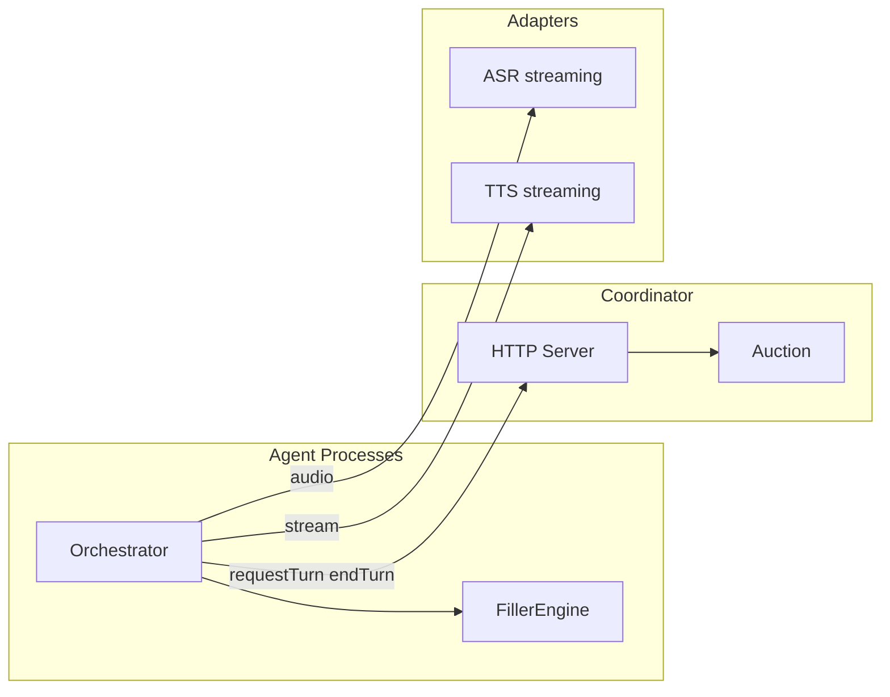

# Low-Latency Cascade Plan

Architecture and contracts for perceived snappiness, multi-agent floor management, and barge-in.

## Objectives

1. **Perceived snappiness**: Reduce dead air and time-to-first-audio (TTFA) even when reasoning takes longer.
2. **Distinct multi-agent personalities**: Different agents feel like different people.
3. **Natural multi-party dynamics**: Agents compete to speak without collisions.
4. **Robust barge-in**: Clean, immediate interruptions with correct state recovery.
5. **Modular framework**: Providers swappable behind adapter contracts.

---

## Architecture Overview

- **Coordinator**: Lease-based floor manager; optional importance-score auction.
- **Orchestrator**: VAD → ASR → memory → (filler) → LLM → TTS; filler plays in parallel with LLM for lower TTFA.
- **FillerEngine**: Picks cached clip or TTS filler by persona; streams clip until main TTS starts.

---

## Contract Summaries

### Coordinator (lease-based)

- **request-turn**: Agents POST with `agentId`, `displayName`, `transcript`, `requestId`. Response: `{ pending: true }` or `{ pending: false, allowed: false }`. After collection window, GET `/turn-decision?requestId=&agentId=` returns `{ decided: true, allowed, turnId?, leaseMs? }`.
- **end-turn**: POST with `agentId`, `userMessage`, `assistantMessage`, `turnId` (required when lease in use). Only clears floor when `turnId` matches current lease; idempotent.
- **Lease**: Grant includes `turnId` and `leaseMs`. Auto-expiry clears floor if not ended in time.

### ASR (streaming + turn detection)

- **transcribe(audioBuffer, format?)**: Batch transcription.
- **createStreamingSession?(options)**: Optional. `options.onPartial`, `options.onTurnEvent?` (`speech_start` | `speech_end` | `end_of_turn_predicted`). `session.push(chunk)`, `session.end()` → final transcript.

### TTS (streaming)

- **synthesize(text, options?)**: Returns `Promise<Buffer>` or `AsyncIterable<Buffer>`.
- **synthesizeStream?(input: AsyncIterable<string>, options?)**: Optional. Yields audio chunks as text streams in; for lower TTFA.

### Filler engine

- **chooseFiller(config, personaId, options?)**: Returns `{ type: "clip", path, lengthMs?, energy? }` or `{ type: "tts", text, energy? }` or `null`.
- **streamFillerClip(path, chunkSize?, shouldAbort?)**: Yields PCM chunks from WAV/raw file; aborts when `shouldAbort()` is true.

---

## Metrics

- **endOfUserSpeechToBotAudioMs**: Primary TTFA KPI.
- **bidPhaseMs**, **winnerSelectionReason**, **bargeInStopLatencyMs**, **turnId**, **requestId**: Logged in TURN_METRICS.

---

## E2E Presets

Presets live in `scripts/e2e-presets/`. Run with `E2E_PRESET=prod-pipeline-fast node scripts/e2e-two-bot.js`. Harness applies gates and timeouts from the preset.

| Preset | Purpose |
|--------|---------|
| **prod-pipeline-fast** | Streaming TTS + fillers + normal LLM; coordinator optional. Emphasizes TTFA. |
| **prod-pipeline-strict** | ASR + reply gates, stricter timeouts, lease expiry. For validation. |
| **prod-audio-plumbing** | Emphasize recv gates and audio energy checks. Validates audio path. |
| **prod-whisper-local** | ASR gate focus; LLM/TTS can be stubbed. |
| **prod-pipeline** | Baseline: bot B uses ASR→LLM→TTS. |
| **prod-podcast** | Both bots full pipeline. |

Report artifact includes `metrics` (last TURN_METRICS: endOfUserSpeechToBotAudioMs, bidPhaseMs, winnerSelectionReason, etc.) for assertions.

### Deterministic stimulus and assertions

- **Stimulus**: Use `scripts/generate-stimuli.js` for WAV; set preset `stimulus.mode` to `"wav"` and `stimulus.wav` path. For speech stimulus, preset can set `stimulus.expectedPhrases` for transcript fuzzy-match.
- **Assertions**: E2E parses JSON logs for TURN_METRICS, AGENT_REPLY, USER_TRANSCRIPT. Report includes `metrics` and gate results. Optional: verify audio energy during playback (e.g. from bot logs or room metrics).

---

## Phased Rollout

- **Phase 0**: Lease-based coordinator, turnId/endTurn in finally, metrics.
- **Phase 1**: Fillers + streaming TTS contract; persona voice options.
- **Phase 2**: Importance-score auction (bids, cooldown, tie-break).
- **Phase 3**: ASR turn detection; VAD as fallback and barge-in.
- **Phase 4**: Barge-in hard stop, context correction, optional speculative generation.
- **Phase 5**: Presets, deterministic stimulus, audibility assertions.
