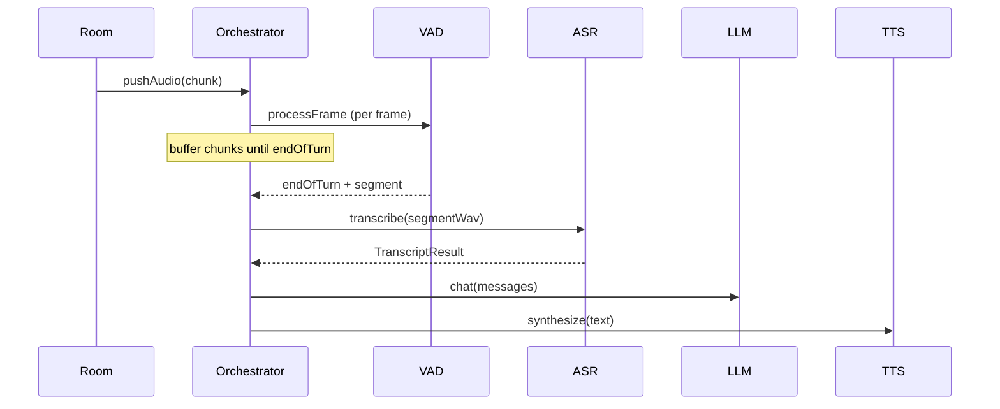
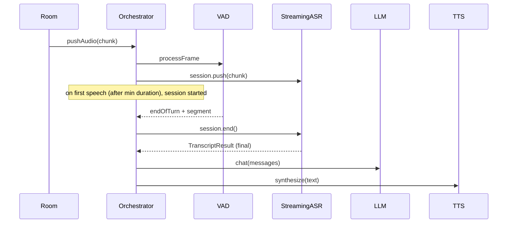

# Streaming ASR Implementation Plan (Local Whisper MVP)

This plan adds optional streaming ASR using **server-local** (self-hosted) Whisper for the MVP, while keeping the existing batch-only pipeline unchanged. Modularity and backwards compatibility are preserved.

---

## Goals

- **Backwards compatibility**: Existing batch ASR (OpenAI Whisper API, stub) behavior and API unchanged; no breaking changes to `IASR.transcribe()` or call sites.
- **Modularity**: ASR remains a swappable adapter (OpenAI, stub, **whisper-local**). Streaming is an optional capability; only adapters that support it implement `createStreamingSession`. Adding future providers (e.g. Deepgram) stays a matter of a new adapter + config.
- **MVP: Server-local Whisper**: Use Whisper running **on the Podium server** (self-hosted in your infrastructure—Jitsi/Jibri/ops server), not on end-user devices. No API key for ASR, no network latency to a cloud ASR; you control model and environment. Design treats server-local Whisper as a first-class, modular adapter.
- **Scalability**: One new adapter in MVP (whisper-local); same contract allows more providers later without orchestrator churn.

---

## Terminology: “Local” = Server-local / Self-hosted

- **Local** in this plan means **server-local**: ASR runs on the same infrastructure as the Podium pipeline (e.g. the machine running Jitsi/Jibri and the Node orchestrator), not on end-user phones or browsers.
- Use “self-hosted” or “server-local” in docs and comments to avoid confusion with on-device ASR (which would be a different integration and threat model).

---

## Current flow (unchanged for batch)

---

## Target flow (when streaming ASR is used)

---

## Phase 1: Types and contract (backwards compatible)

### 1.1 Extend ASR types

**File**: `src/adapters/asr/types.ts`

- **Streaming partial type** — Rich enough for Whisper-like semantics (hypothesis vs append vs final):
  - **Recommended shape**: `StreamingTranscriptPart: { text: string; isFinal: boolean; seq: number; kind?: "hypothesis" | "append" | "final"; language?: string }`
  - **Rationale**: Whisper (and faster-whisper) do not provide true incremental word-by-word streaming; partials are “best current hypothesis” and may **revise** prior text. Without `seq` and `kind`, UI/agent logic gets jittery.
  - **Document in types or adapter doc**:
    - For whisper-local streaming, partials are emitted as `kind="hypothesis"` and may revise prior text; do not treat as append-only.
    - Final result is delivered once at `session.end()` (and optionally as a part with `kind="final"` / `isFinal: true` if the engine emits it).
- **Streaming session type**: e.g. `StreamingSession` with:
  - `push(chunk: Buffer): void` — accepts **raw PCM frames** only (see format contract below).
  - `end(): Promise<TranscriptResult>`
- **IASR** — Add **optional** method only streaming adapters implement:
  - `createStreamingSession?(options: StreamingSessionOptions): StreamingSession`
  - `StreamingSessionOptions`: e.g. `{ sampleRateHz?: number; onPartial?: (part: StreamingTranscriptPart) => void }`
- Keep `transcribe(audioBuffer, format?)` unchanged. All existing adapters continue to implement only this.

### 1.2 PCM and format contract (lock at boundary)

- **`push(chunk)`**:
  - Expects **raw PCM frames** (16-bit mono), **not** WAV or other containers.
  - Chunk framing: define explicitly—e.g. “chunks are 20 ms frames” or “arbitrary chunk sizes up to N ms”; document in the session interface and in the orchestrator (what it passes).
  - If `sampleRateHz` in options differs from 16000, the adapter must either **resample** internally or **reject fast** with a clear error. Do not assume; avoids “garbage transcript” bugs when upstream audio changes.
- **Batch `transcribe(buffer, format?)`**:
  - Supported formats: document as `"wav" | "pcm16"` (or equivalent). The whisper-local adapter must accept both and perform conversion in **one place** (e.g. strip WAV header to PCM when engine expects raw PCM). Existing orchestrator calls `transcribe(segmentWav, "wav")`; that must keep working.

### 1.3 No changes to existing adapters

- `openai-whisper.ts` and `stub.ts` remain batch-only (no `createStreamingSession`). Callers that check for streaming will fall back to the batch path.

---

## Phase 2: Config and factory (server-local Whisper)

### 2.1 Config

**File**: `src/config/index.ts`

- Extend `AsrProvider`: add `"whisper-local"` (e.g. `"openai" | "stub" | "whisper-local"`).
- Extend `config.asr` with optional provider-specific keys for server-local Whisper:
  - `whisperModel?: string` — model name or path (e.g. `tiny`, `base`, `small`). Default e.g. `base` or `small`.
  - `whisperEngine?: string` — how to run Whisper (e.g. `faster-whisper` vs `whisper-cpp`). Optional; adapter can pick a default for MVP.
  - `whisperPythonPath?: string` — optional path to Python when using a Python-based engine.
  - **Kill switch**: add e.g. `whisperForceBatch?: boolean` — when true, adapter never creates a streaming session; always use batch path. Use when streaming is flaky or for debugging.
- **File**: `.env.example`: document `ASR_PROVIDER=openai|whisper-local|stub`, `WHISPER_MODEL=base`, optional `WHISPER_ENGINE`, `WHISPER_PYTHON_PATH`, `WHISPER_FORCE_BATCH=false`.

### 2.2 Validation

- If `asr.provider === "whisper-local"`, validate only what’s required for that provider (e.g. model/engine available; optional: check Python + faster-whisper). Do **not** require `openaiApiKey`.
- Keep existing OpenAI and stub validation unchanged.

### 2.3 Factory

**File**: `src/adapters/asr/index.ts`

- In `createASR(config)`: if `config.asr.provider === "whisper-local"`, return the new whisper-local adapter (pass model, engine, forceBatch, etc.); else keep current logic.
- Export the new adapter and public types so modularity is preserved.

---

## Phase 3: Server-local Whisper ASR adapter (MVP)

### 3.1 Engine boundary: long-lived worker (not one-shot)

- **Do not** spawn a new Python (or other) process **per utterance**. Model load time would dominate and cause high latency and variance.
- **Choose one MVP pattern** and document it clearly:

**A) Long-lived Python worker (recommended for MVP)**

- Start a **single** Python worker process at app boot (or when the first ASR request is needed). Keep the model **loaded** in that process.
- Communicate over **stdin/stdout** (e.g. JSON lines: request/response) or a **localhost** TCP port. Node orchestrator sends PCM chunks and receives partials/final transcript.
- One process per Node process (or one pool if you later support multiple rooms); reuse for all utterances in that process.

**B) Local HTTP server**

- Run a separate `whisperd` (or similar) service on the same host. Node calls it via HTTP/WebSocket.
- Slightly more operational overhead (separate process to deploy/monitor) but same “model loaded once” idea.

For current architecture, **A is recommended** for MVP (simpler to ship, no extra service).

### 3.2 Design: Audio and execution

- **Input**: Pipeline audio is 16 kHz mono 16-bit PCM. Whisper typically expects 16 kHz; no resampling if the adapter receives PCM at 16 kHz. For batch, WAV can be built from PCM (existing `pcmToWav` in orchestrator).
- **Execution**: Prefer **faster-whisper** (Python) for streaming and speed. Alternative: whisper.cpp or Node binding for batch-only MVP.
- **Model**: User-configurable via `WHISPER_MODEL` (e.g. `tiny`, `base`, `small`). Document recommended model for server-local (e.g. `base` or `small`).

### 3.3 New adapter module

**New file**: `src/adapters/asr/whisper-local.ts`

- **Implements IASR**:
  - **transcribe(audioBuffer, format?)**: Run local Whisper on the full buffer. Accept `"wav"` and `"pcm16"` (or equivalent); do format conversion in one place. Return `TranscriptResult` in the same shape as other adapters. This is the **batch** path.
  - **createStreamingSession(options)** (optional): If the engine supports streaming (e.g. faster-whisper) and `whisperForceBatch` is not set, return a session that:
    - **push(chunk)**: sends raw PCM chunks (16 kHz 16-bit) to the long-lived worker.
    - **end()**: signals end of stream, waits for final transcript, returns `Promise<TranscriptResult>`. Call `options.onPartial?.(part)` with parts that have `seq` and `kind` (e.g. `kind="hypothesis"`); throttle to at most e.g. every 500 ms to avoid spamming downstream.
  - If the first version is batch-only (e.g. whisper.cpp without streaming), omit `createStreamingSession`; orchestrator uses the existing batch path.

### 3.4 Invocation and lifecycle

- **Long-lived worker**: Document process lifecycle (start with app or on first use, shutdown on process exit). Ensure no dangling processes on error; on worker crash, fail the current request and optionally restart the worker.
- **Errors**: On failure (process exit, timeout, missing model), reject `transcribe()` or `session.end()` with a clear error. Optional: validate model/engine at startup and fail fast with a helpful message.

### 3.5 Dependencies

- Add dependencies only for the whisper-local adapter (e.g. no new npm deps if using subprocess + Python). Document in README: e.g. “For ASR_PROVIDER=whisper-local, install Python 3.x and `pip install faster-whisper`” or “Build/install whisper.cpp and set WHISPER_MODEL_PATH”.

---

## Phase 4: Orchestrator integration (streaming path)

### 4.1 Session lifecycle

- **When to start a session**: When the **first speech** is detected **and** sustained for a **minimum duration** (e.g. **200–300 ms** of confirmed speech). Do not start on a single frame; VAD often oscillates at boundaries—this avoids creating/tearing down sessions too aggressively.
- **When to push**: On every `pushAudio(chunk)` that belongs to the current utterance, forward the chunk to the active streaming session’s `push(chunk)` (same chunk boundaries as today).
- **When to end a session**: When VAD reports **endOfTurn**. Use the existing VAD **hangover** (silence after speech) as the end trigger; document that this hangover is the “end of turn” boundary so it’s consistent. Call `session.end()`, await `TranscriptResult`, then run the rest of the turn (safety, memory, LLM, TTS) using that result.

### 4.2 VAD edge case: minimum speech duration and hangover

- **Minimum speech duration**: Before starting a streaming session, require e.g. 200–300 ms of consecutive speech frames (or equivalent logic). Otherwise ignore and keep buffering (batch path will still transcribe the segment on endOfTurn).
- **Hangover**: Rely on existing VAD silence/hangover for endOfTurn. Call out in the plan and code that “end of turn” is defined by this hangover so streaming session end is aligned with it.

### 4.3 Orchestrator code changes

**File**: `src/pipeline/orchestrator.ts`

- Add state: e.g. `activeStreamingSession: StreamingSession | null`, and tracking for “we have had enough consecutive speech to start streaming” (e.g. speech frame count or elapsed ms).
- In `pushAudio`:
  - If `this.asr.createStreamingSession` is defined and we are in a speech run with **sustained speech (≥ min duration)** and have an active session: call `session.push(chunk)` in addition to VAD/buffer logic.
  - When we first reach **sustained speech** (min duration) and don’t have an active session: call `this.asr.createStreamingSession({ sampleRateHz: 16000, onPartial: ... })`, store the session, start pushing subsequent chunks.
  - On **endOfTurn**:
    - If we have an active streaming session: call `session.end()`, await `TranscriptResult`, clear the session, run the shared turn logic with that transcript (no second ASR call). Optionally pass the segment only for logging/metrics.
    - If we do **not** have a streaming session: keep current behavior—build WAV from segment, call `asr.transcribe(wavBuffer, "wav")`, then run the rest of the turn.
- **Processing/speaking**: Do not start a new streaming session while `this.processing` or `this.speaking`; only start when we’re in a “user is speaking” run and not processing.

### 4.4 RunTurn reuse

- Refactor so the core turn logic (safety, memory, LLM, TTS, metrics) lives in a shared path that accepts either:
  - `(audioSegment)` and runs ASR internally, or
  - `(transcript: TranscriptResult)` and skips ASR.
- Batch path: `runTurn(segment)` → build WAV → `asr.transcribe(...)` → pass `TranscriptResult` into the shared core.
- Streaming path: on endOfTurn, `session.end()` → get `TranscriptResult` → pass into the same shared core.

### 4.5 Edge cases

- **No speech / empty segment**: If endOfTurn fires but we never started a streaming session, fall back to batch: `transcribe(segmentWav)`. If we did start a session but `end()` returns empty text, treat as “empty transcript” (no turn).
- **Timeouts**: Apply existing ASR timeout to `session.end()` (e.g. `withTimeout(..., this.timeouts.asrMs, "ASR")`). On timeout, clear the session and do not reuse it for the next utterance.
- **Queued segments (barge-in)**: For MVP, **treat queued segments as batch-only**—no streaming session for the pending segment. Document this as a **known limitation**: “Queued (barge-in) turns use batch ASR only.”

---

## Phase 5: Documentation, validation, and acceptance criteria

### 5.1 README / IMPLEMENTATION.md

- Document that ASR can be batch (OpenAI, stub) or streaming (e.g. **whisper-local**). Use **“server-local”** or **“self-hosted”** (on the Podium server), not “user’s machine.”
- Env table: `ASR_PROVIDER`, for whisper-local: `WHISPER_MODEL`, `WHISPER_ENGINE`, `WHISPER_PYTHON_PATH`, `WHISPER_FORCE_BATCH`.
- Setup for server-local Whisper: e.g. install Python 3.x and `pip install faster-whisper`, or document whisper.cpp if used. Recommended model (e.g. `base` or `small`).
- Note: when a streaming provider is configured, the pipeline feeds audio in real time and uses the final transcript at end-of-turn; batch path is unchanged when the adapter is batch-only or when streaming is unavailable. Document the **kill switch** (`WHISPER_FORCE_BATCH`) to force batch mode if streaming misbehaves.

### 5.2 .env.example

- Add commented lines for `ASR_PROVIDER=whisper-local`, `WHISPER_MODEL=base`, `WHISPER_ENGINE=faster-whisper`, `WHISPER_PYTHON_PATH=`, `WHISPER_FORCE_BATCH=false`.

### 5.3 Validation

- Manual: run with `ASR_PROVIDER=openai` and confirm behavior unchanged.
- Manual: run with `ASR_PROVIDER=whisper-local` and local Whisper installed; confirm streaming path is used when supported, and that a full turn (user speaks → bot replies) works. If adapter is batch-only, confirm segment → transcribe → turn works.
- Optional: unit test for whisper-local `transcribe()` with a fixture (e.g. short WAV or PCM).

### 5.4 Acceptance criteria (measurable)

Add explicit targets so “works” is testable:

- **Latency**: End-of-turn transcript returned within **&lt;800 ms** after VAD end (target for base/small model on typical hardware).
- **Partials**: Partial updates (`onPartial`) at most **every 500 ms** (throttle in adapter so downstream is not spammed).
- **Kill switch**: When `WHISPER_FORCE_BATCH=true`, no streaming session is created; batch path is used. Verify in manual test or unit test.
- **Optional**: CPU utilization ceiling per room (e.g. monitor or config limit) to prevent overload; can be a follow-up.

---

## Backwards compatibility summary

| Area             | Guarantee                                                                                                         |
| ---------------- | ----------------------------------------------------------------------------------------------------------------- |
| **IASR**         | `transcribe()` remains the only required method. Existing callers and batch adapters unchanged.                   |
| **Orchestrator** | If `createStreamingSession` is not defined, behavior is identical to today (segment → transcribe → turn).         |
| **Config**       | Default `ASR_PROVIDER` remains `openai`. New env vars required only when using whisper-local.                     |
| **Dependencies** | New dependency only for the new adapter; OpenAI and stub paths have no new deps.                                   |

---

## Scalability and MVP scope

- **Modularity**: Adding another ASR provider (e.g. Deepgram, another cloud or local engine) is done by implementing `IASR` (and optionally `createStreamingSession`) in a new file, adding the provider to `AsrProvider` and config, and extending `createASR()`. No orchestrator changes needed. Whisper-local is the first new provider; the same contract keeps OpenAI, whisper-local, and future providers swappable via config.
- **MVP**: One new provider—**server-local Whisper**—with optional streaming when the chosen engine supports it (e.g. faster-whisper). Long-lived worker, not one-shot per utterance. No speculative LLM on interim partials. Known limitation: queued (barge-in) segments use batch ASR only. Optional future work: use `onPartial` with `kind`/`seq` for UI or earlier LLM triggers; add a remote streaming provider (e.g. Deepgram) for multi-user/server deployments.
